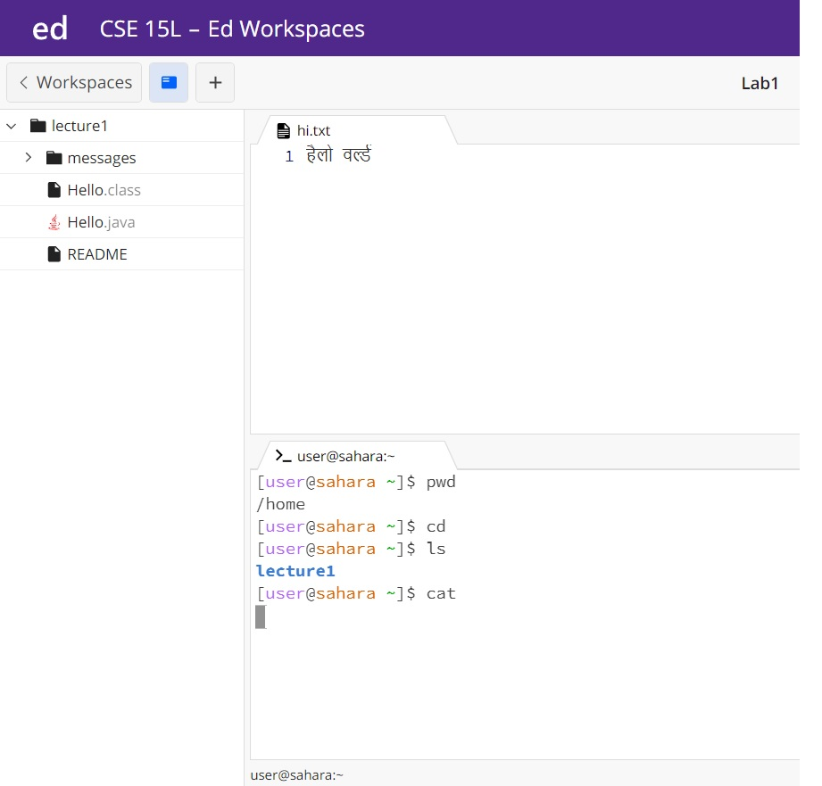
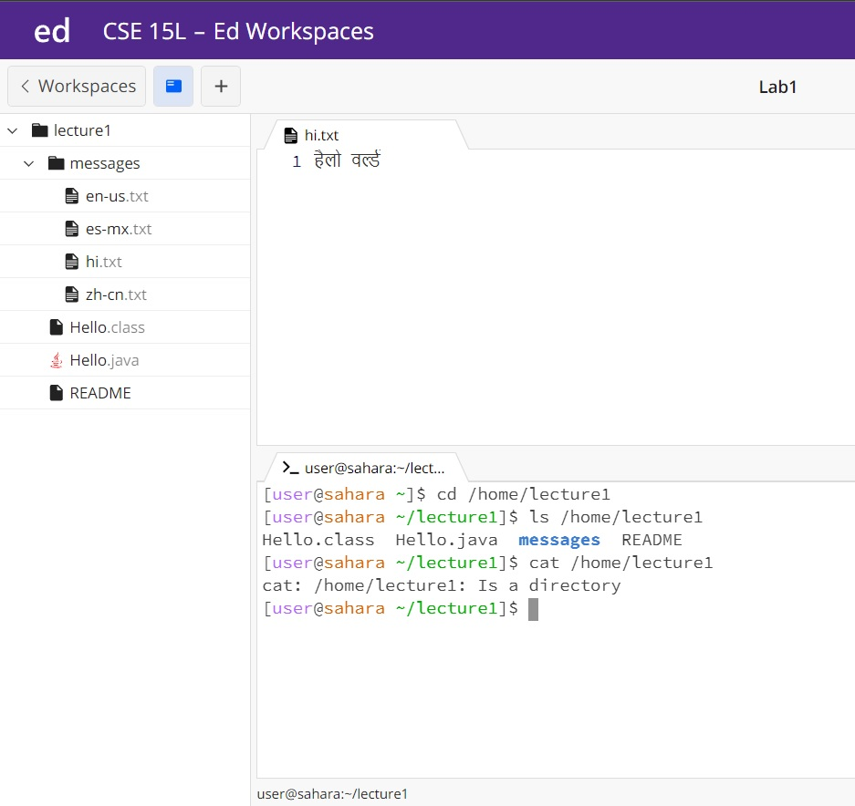
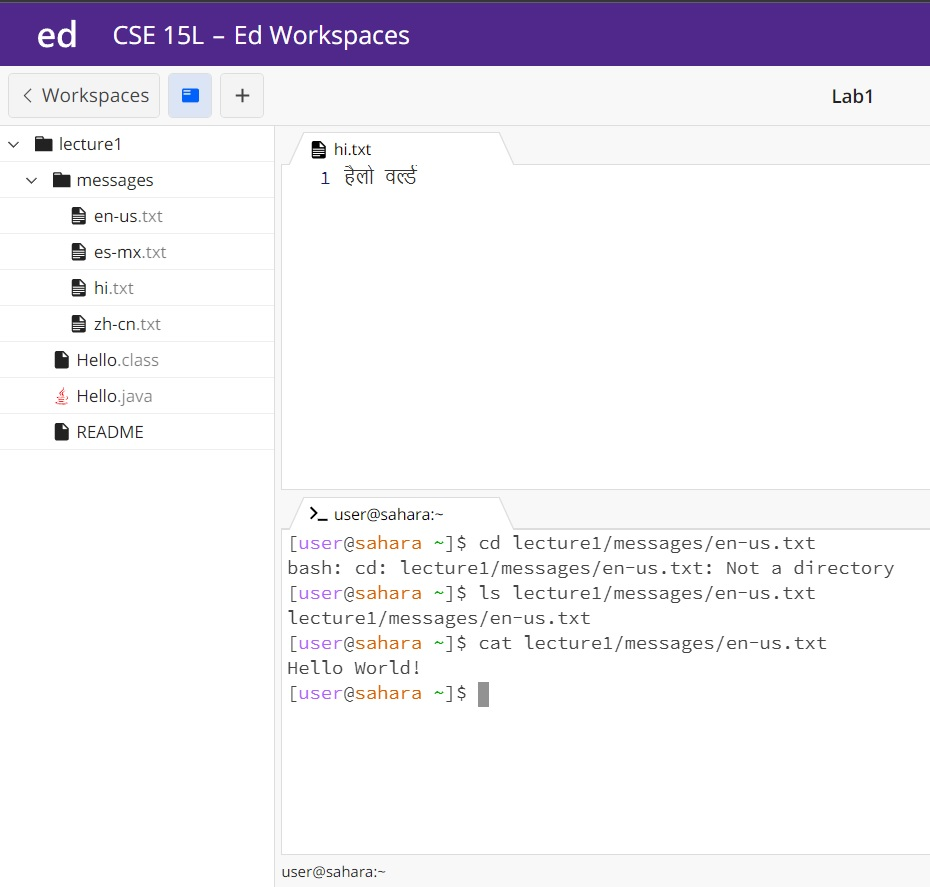

# Lab Report 1 - Remote Access and FileSystem (Week 1)

## I will be explaining how these 3 basic filesystem commands work through example: 

* cd
* ls
* cat

## I will be exploring these commands through these 3 questions:

1) **What happends when we use the command with no arguments?**

* In this screenshot, the working directory was /home throughout the inputted commands 
* A sentence or two explaining why you got that output (e.g. what was in the filesystem, what it meant to have no arguments).

* Indicate whether the output is an error or not, and if it’s an error, explain why it’s an error.

2) **What happends when we use the command with a path to a directory as an argument**

* In this screenshot, /home was the working directory for cd but ls and cat were inputted in the working directory of ~/lecture1 (/home/lecture1)
* A sentence or two explaining why you got that output (e.g. what was in the filesystem, what it meant to have no arguments).
* Indicate whether the output is an error or not, and if it’s an error, explain why it’s an error.

3) **What happends when we use the command with a path to a file as an argument**
      

* In this screenshot, the working directory was /home throughout the inputted commands
* A sentence or two explaining why you got that output (e.g. what was in the filesystem, what it meant to have no arguments).
* Indicate whether the output is an error or not, and if it’s an error, explain why it’s an error.
